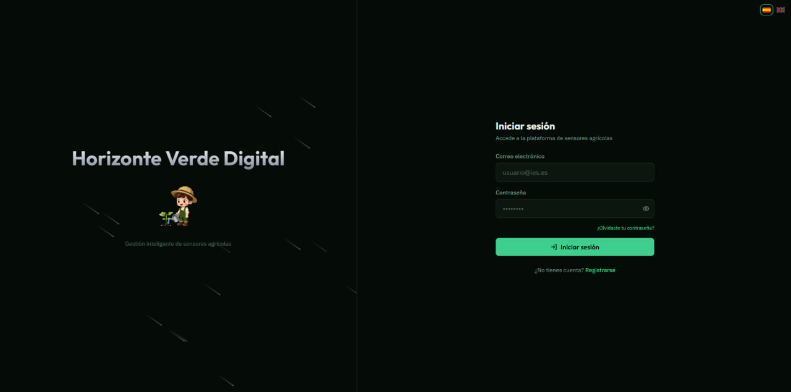
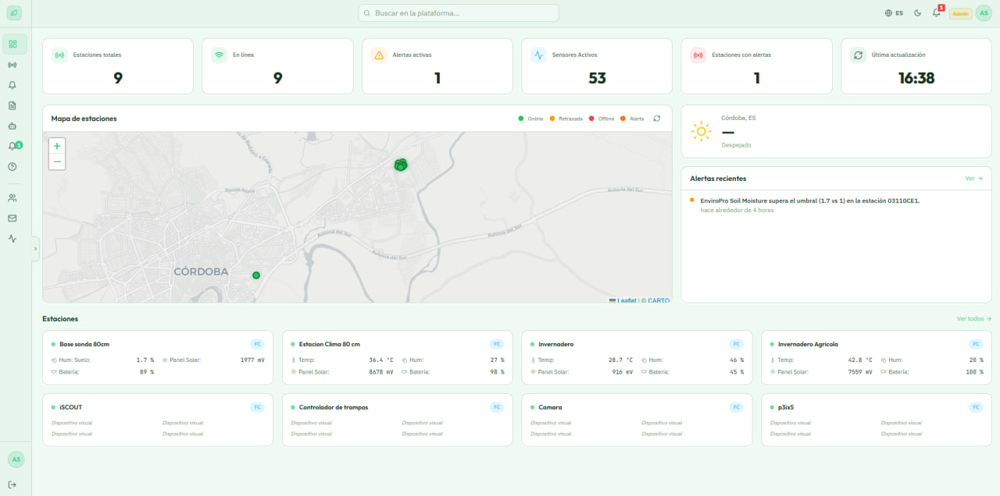
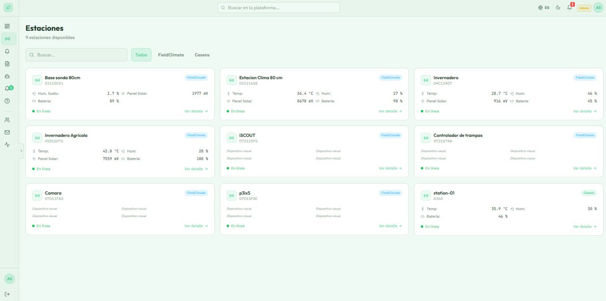
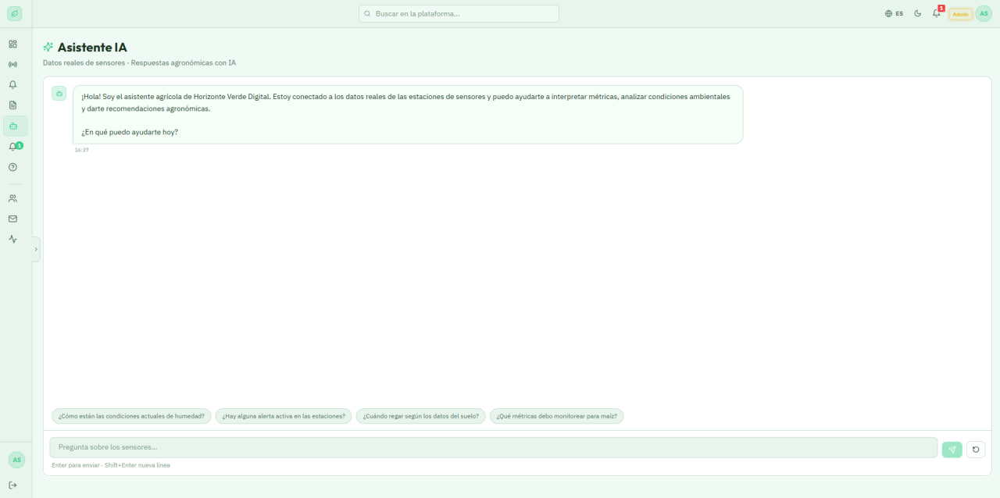

<div align="center">


# Horizonte Verde Digital

**Unified Agricultural Sensor Management Platform**

[](https://nodejs.org/)
[](https://react.dev/)
[](https://www.mongodb.com/atlas)
[](https://tailwindcss.com/)
[](https://expressjs.com/)
[](LICENSE)

[Live Demo](https://nuevo-horizonte-digital.vercel.app) · [Report Bug](https://github.com/G4GT1/Nuevo-Horizonte-Digital/issues) · [Request Feature](https://github.com/G4GT1/Nuevo-Horizonte-Digital/issues)

</div>

---

## 📋 About

**Horizonte Verde Digital** is a full-stack web platform that unifies multiple agricultural sensor networks into a single, modern interface. Built for **IES Galileo Galilei** (Córdoba, Spain), it consolidates data from **FieldClimate** (GSM/METOS) and **Cesens** (LoRa) sensors, providing real-time monitoring, historical analysis, and intelligent alerts for agricultural technicians and students.

### The Problem

The institute managed a complex ecosystem of sensors across different platforms — FieldClimate for GSM stations, Cesens for LoRa nodes — each with its own web interface, authentication, and data format. Staff had to juggle multiple logins and manually compare data across platforms.

### The Solution

A unified dashboard that aggregates all sensor data in real-time, with role-based access, configurable alerts, AI-powered assistance, and professional reporting — all in one place.

---

## ✨ Features

<table>
<tr>
<td width="50%">

### 📊 Real-Time Dashboard
- Interactive map with all stations geolocated
- Live KPIs: online stations, active sensors, alerts
- Weather forecast widget (Open-Meteo)
- Station cards with real-time metrics

</td>
<td width="50%">

### 📡 Multi-Source Integration
- FieldClimate API v2 (HMAC-SHA256 auth)
- Cesens API (Token-based auth)
- Automatic sensor data normalisation
- Separate and unified endpoints

</td>
</tr>
<tr>
<td width="50%">

### ⚠️ Smart Alert System
- Configurable thresholds per station/metric
- Dynamic metric selection based on station sensors
- Automatic job every 15 minutes
- Email notifications for critical alerts
- In-app notifications in real-time via WebSockets

</td>
<td width="50%">

### 🤖 AI Assistant
- Powered by Groq (Llama 3.3 70B)
- Access to real-time sensor data
- Concise agricultural insights
- Bilingual support (ES/EN)
- Help section with FAQ and chatbot

</td>
</tr>
<tr>
<td width="50%">

### 📄 Professional Reports
- PDF generation with live preview
- Excel export with daily summaries
- Min/Max/Average statistics per metric
- Custom date range selection

</td>
<td width="50%">

### 🔐 Role-Based Access Control
- **Admin** — Full platform management
- **Technician** — Alerts, reports, sensor management
- **Student** — Read-only access to data and AI
- Invitation system with magic links

</td>
</tr>
</table>

### Additional Features

- 🌙 **Dark/Light mode** with system preference detection
- 🌐 **Bilingual** interface (Spanish/English) with i18next
- 📧 **Transactional emails** — verification, invitations, alerts, weekly reports
- 🔔 **Real-time notifications** via Socket.io
- 📱 **Responsive design** — desktop, tablet, mobile
- 🔍 **Global search** — navigate pages, stations, and actions
- ✅ **Form validation** — react-hook-form + zod with live feedback
- 📊 **Historical charts** — sensor data with selectable metrics and time ranges
- 🗺️ **Interactive map** — Leaflet with custom markers by status and source

---

## 🛠️ Tech Stack

### Backend

| Technology | Purpose |
|---|---|
| **Node.js 20** + **Express 5** | REST API server |
| **MongoDB Atlas** + **Mongoose** | Cloud database with ODM |
| **JWT** (access + refresh) | Stateless authentication |
| **bcrypt** (salt 12) | Password hashing |
| **Socket.io** | Real-time WebSocket events |
| **node-cron** | Scheduled jobs (alerts, reports) |
| **MailerSend** | Transactional email delivery |
| **Groq API** | AI chatbot (Llama 3.3 70B) |
| **helmet** + **cors** + **rate-limit** | Security middleware |
| **Swagger** | API documentation |

### Frontend

| Technology | Purpose |
|---|---|
| **React 18** + **Vite** | UI framework + build tool |
| **TailwindCSS** | Utility-first styling |
| **Zustand** + persist | Global state management |
| **TanStack Query v5** | Server state + caching |
| **Axios** | HTTP client with interceptors |
| **React-Leaflet** | Interactive maps |
| **Recharts** | Sensor data charts |
| **i18next** | Internationalisation (ES/EN) |
| **react-hook-form** + **zod** | Form validation |
| **lucide-react** | Icon library |
| **date-fns** | Date formatting |

### External APIs

| API | Purpose |
|---|---|
| **FieldClimate v2** | GSM sensor data (HMAC-SHA256) |
| **Cesens** | LoRa sensor data (Token auth) |
| **Open-Meteo** | Weather forecast (free, no key) |
| **Groq** | AI inference (Llama 3.3 70B) |

---

## 🏗️ Architecture

```
┌─────────────────────────────────────────────────────┐
│              FRONTEND (Vercel)                       │
│          React + Vite + TailwindCSS                  │
└──────────────────────┬──────────────────────────────┘
                       │ HTTPS / REST / WebSocket
┌──────────────────────▼──────────────────────────────┐
│                BACKEND (Railway)                     │
│              Node.js + Express 5                     │
│                                                      │
│  Auth │ Stations │ Alerts │ AI │ Reports │ WebSocket │
└──────────────────────┬──────────────────────────────┘
                       │
        ┌──────────────┼──────────────┐
        │              │              │
  FieldClimate    Cesens API    MongoDB Atlas
    API v2                      (Database)
```

---

## 🚀 Getting Started

### Prerequisites

- Node.js 20+
- MongoDB Atlas account
- FieldClimate API credentials
- Cesens API credentials
- MailerSend API key
- Groq API key

### Installation

```bash
# Clone the repository
git clone https://github.com/G4GT1/Nuevo-Horizonte-Digital.git
cd Nuevo-Horizonte-Digital

# Backend setup
cd backend
npm install
cp .env.example .env
# Edit .env with your credentials

# Generate VAPID keys (if using push notifications)
npx web-push generate-vapid-keys

# Seed the first admin user
npm run seed

# Start backend
npm run dev

# Frontend setup (new terminal)
cd ../frontend
npm install
cp .env.example .env
# Edit .env with your API URL

# Start frontend
npm run dev
```

### Environment Variables

<details>
<summary><strong>Backend (.env)</strong></summary>

```env
# Server
PORT=4000
NODE_ENV=development

# Database
MONGODB_URI=mongodb+srv://...
MONGODB_DB_NAME=horizonte_verde

# JWT
SECRET_KEY=your_jwt_secret
REFRESH_SECRET_KEY=your_refresh_secret

# CORS
FRONTEND_URL=http://localhost:5173

# Email (MailerSend)
MAILERSEND_API_KEY=...
MAILERSEND_FROM=no-reply@yourdomain.com
MAILERSEND_FROM_NAME=Horizonte Verde Digital

# FieldClimate
FIELDCLIMATE_PUBLIC_KEY=...
FIELDCLIMATE_PRIVATE_KEY=...

# Cesens
CESENS_NOMBRE=...
CESENS_CLAVE=...

# Groq AI
GROQ_API_KEY=...

# Seed Admin
SEED_ADMIN_EMAIL=admin@example.com
SEED_ADMIN_PASSWORD=SecurePassword123!
SEED_ADMIN_NOMBRE=Administrator
```

</details>

<details>
<summary><strong>Frontend (.env)</strong></summary>

```env
VITE_API_URL=http://localhost:4000/api
VITE_SOCKET_URL=http://localhost:4000
```

</details>

---

## 📁 Project Structure

```
Nuevo-Horizonte-Digital/
├── backend/
│   └── src/
│       ├── config.js
│       ├── app.js
│       ├── models/
│       ├── controllers/
│       ├── routes/
│       ├── services/
│       ├── middleware/
│       ├── validators/
│       ├── jobs/
│       ├── utils/
│       ├── emails/
│       ├── sockets/
│       ├── data/
│       └── seed/
│
├── frontend/
│   └── src/
│       ├── app/
│       ├── shared/
│       │   ├── components/
│       │   ├── hooks/
│       │   ├── lib/
│       │   ├── store/
│       │   ├── api/
│       │   └── locales/
│       └── features/
│           ├── auth/
│           ├── dashboard/
│           ├── stations/
│           ├── alerts/
│           ├── reports/
│           ├── ai/
│           ├── notifications/
│           ├── help/
│           ├── profile/
│           └── admin/
│
└── .gitignore
```

---

## 👥 Roles & Permissions

| Permission | Admin | Technician | Student |
|---|:---:|:---:|:---:|
| View stations & data | ✅ | ✅ | ✅ |
| Historical charts | ✅ | ✅ | ✅ |
| AI Assistant | ✅ | ✅ | ✅ |
| Weather forecast | ✅ | ✅ | ✅ |
| Configure alerts | ✅ | ✅ | ❌ |
| Export reports | ✅ | ✅ | ❌ |
| Manage users | ✅ | 🔶 | ❌ |
| Send invitations | ✅ | ❌ | ❌ |
| View activity logs | ✅ | ❌ | ❌ |

> 🔶 Technicians can only manage Student accounts

---

## 🌐 Deployment

| Service | Component | Tier |
|---|---|---|
| **Vercel** | Frontend | Free |
| **Railway** | Backend | ~5€/month |
| **MongoDB Atlas** | Database | Free (512MB) |

---

## 📸 In the Field && Screenshoots

<div align="center">




</div>

---

## 🔮 Future Roadmap

- 🔵 Google OAuth integration
- 📧 Production email service upgrade
- 📱 Progressive Web App (PWA)
- 📊 Predictive analytics for crop health
- 🔐 Two-factor authentication (TOTP)
- 🧪 Automated testing suite

---

## 📄 License

This project is part of a **Final Degree Project (TFG)** for the DAW (Web Application Development) programme at IES Trassierra, Córdoba, Spain.

---

## 👤 Author

**Ghalib Ahmad**

- GitHub: [@G4GT1](https://github.com/G4GT1)

---

<div align="center">

Built with 💚 for sustainable agriculture

**[⬆ Back to top](#-horizonte-verde-digital)**

</div>
